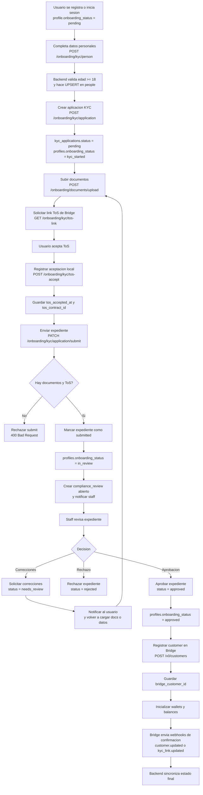
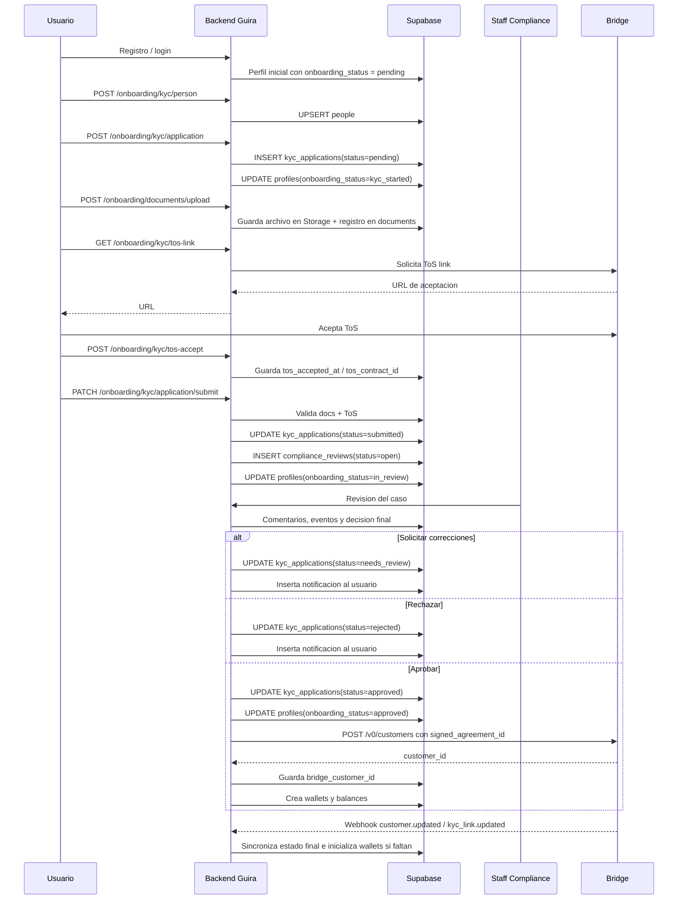

# Flujograma KYC - Guira Backend

Documento de apoyo para presentacion.

Base tecnica revisada en:
- `src/application/auth/auth.service.ts`
- `src/application/onboarding/onboarding.controller.ts`
- `src/application/onboarding/onboarding.service.ts`
- `src/application/compliance/compliance-actions.service.ts`
- `src/application/onboarding/bridge-customer.service.ts`
- `src/application/webhooks/webhooks.service.ts`

## 1. Resumen ejecutivo

El flujo KYC actual del proyecto funciona en dos capas:

1. Capa interna de Guira:
- el usuario llena datos
- sube documentos
- acepta ToS
- envia expediente
- el staff de compliance revisa y decide

2. Capa de integracion con Bridge:
- Guira genera el link de ToS de Bridge
- cuando compliance aprueba, Guira crea el `customer` en Bridge
- luego Bridge puede reconfirmar estados por webhook

En otras palabras: hoy el backend no depende solo de un formulario externo de Bridge para aprobar al cliente. Primero existe un expediente interno y una revision humana, y despues se formaliza el alta en Bridge.

## 2. Flujograma principal



## 3. Diagrama por actores



## 4. Paso a paso explicado

### Paso 0. Registro e identidad base

- El usuario se registra en Supabase Auth.
- Un trigger crea el perfil base en `profiles`.
- El backend retorna `onboarding_status = pending`.

### Paso 1. Captura de datos personales

- El frontend envia los datos biograficos a `POST /onboarding/kyc/person`.
- El backend valida que la persona sea mayor de edad.
- Si ya existe un registro en `people`, lo actualiza; si no existe, lo crea.

Que se guarda aqui:
- nombre y apellido
- fecha de nacimiento
- tipo y numero de documento
- email y telefono
- direccion
- nacionalidad
- banderas de riesgo como `is_pep`
- datos extra para Bridge como `source_of_funds`, `account_purpose`, `employment_status`

### Paso 2. Apertura del expediente KYC

- El usuario crea su solicitud formal con `POST /onboarding/kyc/application`.
- El sistema liga la solicitud al `person_id`.
- Si ya hay una aplicacion activa (`pending`, `submitted`, `in_review`), la reutiliza para no duplicar casos.

Efectos:
- `kyc_applications.status = pending`
- `profiles.onboarding_status = kyc_started`

### Paso 3. Carga documental

- El usuario sube documentos a `POST /onboarding/documents/upload`.
- El archivo se guarda en Supabase Storage.
- Luego se registra en la tabla `documents`.

Validaciones tecnicas:
- solo PDF, JPG o PNG
- maximo 10 MB
- para KYC persona natural el `subject_type` esperado es `person`

### Paso 4. Aceptacion de ToS de Bridge

- El frontend pide un link con `GET /onboarding/kyc/tos-link`.
- Si el usuario ya tiene `bridge_customer_id`, se pide un link para customer existente.
- Si aun no existe customer en Bridge, se usa `POST /v0/customers/tos_links`.

Despues:
- el usuario acepta los terminos
- el frontend/backend registra la aceptacion en `POST /onboarding/kyc/tos-accept`
- se guardan `tos_accepted_at` y `tos_contract_id`

Punto importante para la presentacion:
- el `tos_contract_id` es clave porque luego se reutiliza como `signed_agreement_id` al crear el customer en Bridge

### Paso 5. Envio del expediente

- El usuario ejecuta `PATCH /onboarding/kyc/application/submit`.
- Antes de aceptar el envio, el backend valida dos cosas:

1. que exista al menos un documento cargado para `subject_type = person`
2. que ya exista aceptacion de ToS

Si falta algo:
- el backend devuelve `400`
- el expediente no cambia de estado

Si todo esta completo:
- `kyc_applications.status = submitted`
- `submitted_at` se llena
- `profiles.onboarding_status = in_review`
- se crea automaticamente un `compliance_review`
- se notifica al staff

### Paso 6. Revision interna de compliance

Esta es la parte central del flujo actual.

El staff puede:
- asignarse el caso
- comentar
- escalar prioridad
- aprobar
- rechazar
- pedir correcciones

Si pide correcciones:
- el expediente cambia a `needs_review`
- el review sigue abierto
- el usuario recibe una notificacion
- el flujo vuelve a etapa de carga/correccion y luego reenvio

Si rechaza:
- el expediente cambia a `rejected`
- el usuario es notificado

Si aprueba:
- el expediente cambia a `approved`
- el perfil pasa a `onboarding_status = approved`
- inmediatamente se dispara el alta en Bridge

### Paso 7. Registro del customer en Bridge

Una vez aprobado localmente, `BridgeCustomerService` arma el payload para `POST /v0/customers`.

Ese payload se construye desde:
- `people`
- `documents`
- `profiles`
- `kyc_applications.tos_contract_id`

Y envia a Bridge:
- datos personales
- `signed_agreement_id`
- `identifying_information`
- documentos en base64 cuando aplica
- direccion en formato Bridge
- datos de riesgo o compliance

Si Bridge responde bien:
- se guarda `profiles.bridge_customer_id`
- se inicializan wallets y balances

### Paso 8. Confirmacion asincronica por webhook

Ademas del flujo principal, el sistema tiene una capa de sincronizacion por webhooks:

- `customer.updated`
- `customer.updated.status_transitioned`
- `kyc_link.updated.status_transitioned`
- `kyc_link.approved` legacy

Cuando llega confirmacion positiva:
- el backend vuelve a marcar `onboarding_status = approved` si hacia falta
- completa o reconfirma `bridge_customer_id`
- crea wallets si aun no existen
- deja trazabilidad en notificaciones y activity logs

## 5. Estados que debes mostrar en presentacion

### Estado del perfil

```text
pending -> kyc_started -> in_review -> approved
```

### Estado del expediente KYC

```text
pending -> submitted -> approved
                 -> needs_review -> submitted
                 -> rejected
```

### Estado del review de compliance

```text
open -> closed
open -> needs changes operativamente, pero el review sigue abierto
```

Nota:
- en el codigo actual el review se cierra en aprobacion o rechazo
- cuando se piden cambios, el review no se cierra; el expediente vuelve a correccion

## 6. Que valida el sistema antes de habilitar operacion

Para que el usuario termine operativo se combinan estas piezas:

- perfil autenticado y activo
- datos personales completos
- expediente KYC creado
- documentos cargados
- ToS aceptado
- aprobacion de compliance
- customer registrado en Bridge
- wallet y balances inicializados

Solo cuando el perfil queda:
- `profiles.onboarding_status = approved`
- `profiles.bridge_customer_id` con valor

el resto de modulos financieros permite operar.

## 7. Hallazgos importantes para explicar "como funciona hoy"

### A. El flujo principal es interno primero, Bridge despues

Aunque Bridge participa desde el ToS, la aprobacion operativa del backend hoy pasa por revision humana interna.

### B. Existe codigo legado o complementario de `bridge_kyc_links`

Hay handlers y documentacion para un flujo de `bridge_kyc_links`, pero el controlador actual de onboarding no crea esos links como camino principal del usuario.

Para presentar el proyecto sin confundir:
- muestra como flujo principal: expediente interno + compliance + alta en Bridge
- menciona `bridge_kyc_links` como capa complementaria o legado de sincronizacion

### C. Bridge no es solo verificacion; tambien es provision de customer y wallets

En este backend, Bridge no se usa unicamente para revisar identidad.
Tambien queda como proveedor de:
- customer financiero
- wallets blockchain
- cuentas virtuales y pagos posteriores

## 8. Guion corto para exponer

Puedes explicarlo asi:

1. El usuario se registra y queda con estado `pending`.
2. Completa sus datos KYC y se crea un expediente interno.
3. Sube sus documentos y acepta los terminos de Bridge.
4. Cuando envia el expediente, Guira lo pasa a `in_review` y abre un caso de compliance.
5. El staff analiza el caso y puede pedir correcciones, rechazar o aprobar.
6. Si se aprueba, el backend registra formalmente al cliente en Bridge usando el ToS firmado.
7. Bridge devuelve el `customer_id`, se guardan wallets y balances, y el usuario queda habilitado para operar.

## 9. Mensaje final para la slide

El onboarding KYC de Guira no es solo un formulario.
Es un pipeline de cumplimiento:

- captura de identidad
- evidencia documental
- aceptacion regulatoria
- revision interna auditable
- alta financiera en Bridge
- habilitacion operativa final

